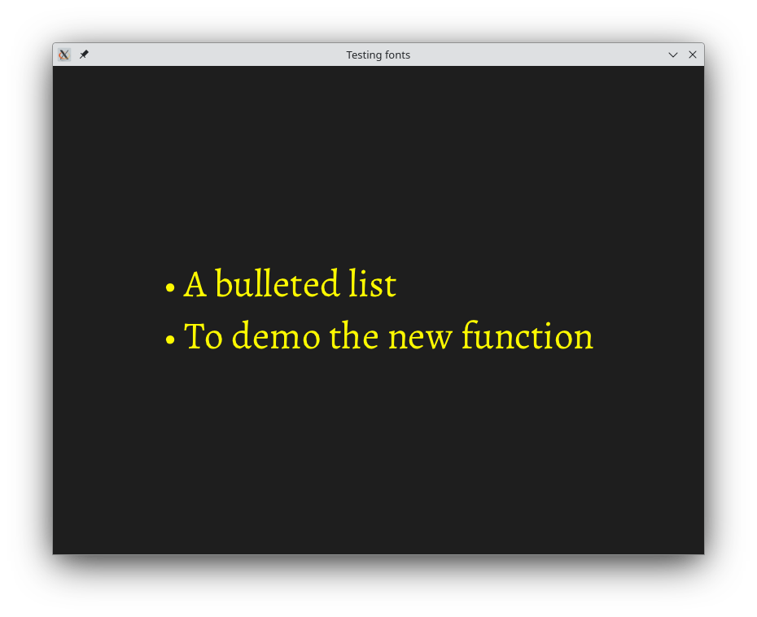

# Introduction

This project is a simple demo of a new feature I am thinking about for the raylib library.

It uses the default character set for the font, but then adds a "bullet" character so as to allow the following to be displayed.

